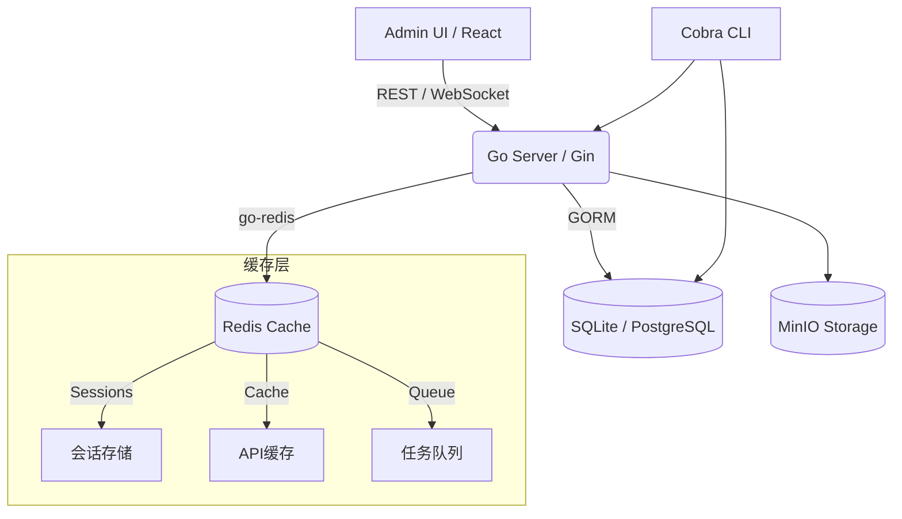

# go-vibe-friend

> **go-vibe-friend** 是一个开箱即用的 Go 后端 Admin 管理系统工程模板：
>
> 1. **5分钟启动** 完整的企业级管理后台（后端 + 前端 + 数据库）；
> 2. **现代技术栈** Go 1.22+ + PostgreSQL + Redis + React 18；
> 3. **生产就绪** 用户认证、权限管理、文件存储、数据导出等企业级功能；
> 4. **高性能架构** 分层设计、缓存优化、容器化部署；
> 5. **完全开源** 插件化架构，快速定制业务功能。

---

## ✨ 主要特性

* **开箱即用**：单条命令 `make dev` 立即启动完整管理后台（后端 + 前端 + 数据库）。
* **企业级认证**：JWT / Session 双模式；用户注册、登录、权限管理 RBAC 体系。
* **完整功能模块**：用户管理、文件存储、数据导出、系统监控、Redis缓存管理。
* **现代化前端**：基于 React 18 + TypeScript + Tailwind + shadcn/ui，响应式设计支持深/浅色主题。
* **高性能架构**：Go 并发处理 + PostgreSQL 事务 + Redis 缓存，支持高并发访问。
* **生产部署**：Docker 容器化、GitHub Actions CI/CD、完整测试覆盖、监控日志。

---

## 🛠️ 技术栈

### Backend

| 技术                | 用途         |
| ----------------- | ---------- |
| **Go 1.22+**      | 主语言        |
| **Gin**           | HTTP 框架    |
| **GORM**          | ORM & 自动迁移 |
| **Cobra / Viper** | CLI & 配置管理 |
| **JWT-Go**        | JWT 认证        |
| **Air**           | 热重载开发      |

### Frontend (Admin UI)

| 技术                           | 用途         |
| ---------------------------- | ---------- |
| **React 18**                 | UI 框架      |
| **Vite + pnpm + TypeScript** | 构建工具 & 包管理 |
| **Tailwind CSS**             | 样式         |
| **shadcn/ui**                | 组件库        |
| **Lucide React**             | 图标库        |

### Infrastructure

| 技术                     | 用途                       |
| ---------------------- | ------------------------ |
| **PostgreSQL**         | 默认主数据库                   |
| **SQLite / MySQL**     | 可选替代数据库                  |
| **Redis**              | 缓存 / 会话 / 任务队列           |
| **MinIO**              | 对象存储服务（文件管理）             |
| **Docker & Compose**   | 本地和生产容器化                 |
| **GitHub Actions**     | CI / Lint / Test / Build |

---

## 📂 项目结构

```text
go-vibe-friend/
├── cmd/                    # 可执行入口
│   └── server/             # main.go / flags / embed.FS
├── internal/               # 领域包（按 Clean Architecture 可再细分）
│   ├── api/                # Gin/Fiber Handler + Router
│   │   ├── admin/          # /api/admin/…
│   │   └── vf/             # /api/vf/…
│   ├── config/             # Viper / env 解析
│   ├── models/             # GORM/Ent 实体 (User, GenerationJob…)
│   ├── service/            # 业务逻辑 (AuthService, JobService…)
│   ├── store/              # DB ↔ Repo（可放 DAO / Query）
│   ├── jobs/               # LLM 生成 Worker & 队列
│   └── utils/              # 公共库 (hash, jwt, logger…)
├── migrations/             # *.sql 或 Atlas / golang-migrate 文件
│   └── 20250718_initial.sql
├── web/                    # 前端
│   └── admin/              # React + Vite + Tailwind 源码
│       ├── src/
│       ├── index.html
│       └── vite.config.ts
├── scripts/                # 本地或 CI 辅助脚本 (seed_db.sh, gen.sh…)
├── docs/                   # 技术/产品文档
│   ├── api-file-go-vibe-friend.md
│   ├── data-model-go-vibe-friend.md
│   └── ...
├── .github/                # GitHub Actions workflows / ISSUE_TEMPLATE
│   └── workflows/ci.yml
├── tests/                  # Go 单元/集成测试
│   └── api_test.go
├── Dockerfile              # 后端容器
├── docker-compose.yml      # 本地编排 (app + postgres)
├── Makefile                # make dev / build / lint / migrate
├── .env.example            # 默认环境变量
├── .gitignore
├── LICENSE
└── README.md               # 项目总览（Canvas README 已同步）

```

---

## ⚡ 快速开始

### 1. 克隆仓库

```bash
git clone https://github.com/yourname/go-vibe-friend.git
cd go-vibe-friend
```

### 2. 环境准备

* **Go ≥ 1.22**
* **Node.js ≥ 20** & **pnpm ≥ 9**
* **Docker** & **Docker Compose** (可选，用于 PostgreSQL/MySQL)
```bash
cp .env.example .env
# 编辑 .env，配置数据库连接等环境变量
```

### 3. 首次设置（推荐）

```bash
make setup
```

这会自动安装依赖并启动 PostgreSQL 数据库。

### 4. 启动开发环境

```bash
make dev
```

* 后端：`http://localhost:8080`
* Admin UI：`http://localhost:5173`
* 数据库：PostgreSQL (localhost:5432)，首次运行自动迁移基础表。
* Redis：`localhost:6379`，用于缓存和会话存储
* MinIO：`http://localhost:9000` (API) / `http://localhost:9001` (Console)

### 可选：启动MinIO对象存储

如需文件存储功能，可启动MinIO服务：

```bash
# 启动MinIO服务
docker-compose -f docker-compose.minio.yml up -d

# 查看MinIO状态
docker-compose -f docker-compose.minio.yml ps
```

MinIO访问信息：
- **API端点**: http://localhost:9000
- **Web Console**: http://localhost:9001
- **用户名**: minioadmin
- **密码**: minioadmin123

### 5. 开始使用

1. 访问 Admin UI → **Dashboard** 页面。
2. 使用内置的用户管理、权限管理、文件存储等功能。
3. 通过 API 测试页面验证接口功能。
4. 根据业务需求扩展和定制功能模块。

---

## 🏗️ 架构图



---

## 🔧 常用脚本

| 命令             | 说明                     |
| -------------- | ---------------------- |
| `make setup`   | 首次设置开发环境（推荐）           |
| `make dev`     | 热重载启动后端 & 前端           |
| `make db-start`| 启动 PostgreSQL 数据库     |
| `make db-stop` | 停止 PostgreSQL 数据库     |
| `make migrate` | 执行所有数据库迁移              |
| `make test`    | 运行后端单元测试               |
| `make lint`    | GolangCI‑Lint + ESLint |
| `make build`   | 构建二进制与前端产物             |

> 完整脚本列表见 [`Makefile`](./Makefile)。

### 🗄️ 数据库管理

本项目使用 **PostgreSQL** 作为主数据库，通过 Docker Compose 管理。详细的数据库配置和使用说明请参考 [DATABASE.md](./DATABASE.md)。

主要命令：
- `make setup` - 首次设置，自动启动数据库
- `make dev` - 启动开发环境，自动检查并启动数据库
- `make db-start` - 单独启动数据库
- `make db-stop` - 停止数据库
- `make db-logs` - 查看数据库日志

数据库连接信息：
- **主机**: localhost:5432
- **用户**: postgres/postgres
- **数据库**: go_vibe_friend

### 🗄️ Redis 缓存管理

本项目集成 **Redis** 作为缓存层和会话存储，显著提升系统性能。

主要用途：
- **会话管理** - 用户登录状态和Session存储
- **API缓存** - Admin面板数据、统计信息缓存
- **任务队列** - 异步任务处理
- **实时通知** - WebSocket消息广播

Redis连接信息：
- **主机**: localhost:6379
- **密码**: 无（开发环境）
- **数据库**: 0（默认）

---

## 🚀 生产部署

```bash
# 1. 构建容器镜像
make docker-build

# 2. 启动
docker compose -f docker-compose.prod.yml up -d
```

> 默认 `docker-compose.prod.yml` 使用 PostgreSQL 作为存储，并开启自动迁移。

---

## 🤝 贡献指南

1. Fork → 新建分支 (`feat/awesome-feature`)
2. 提交代码并确保 **Signed‑off‑by**
3. 提交 Pull Request，并关联 Issue
4. 通过 CI 检查与 Code Review 后合并

> 详细规范参见 [`CONTRIBUTING.md`](./CONTRIBUTING.md)。

---

## 🛡️ License

Distributed under the **MIT License**. See [`LICENSE`](./LICENSE) for more information.

---

## 🎯 Roadmap

*

---

## 🌟 致谢

* [Gin](https://github.com/gin-gonic/gin) – HTTP 新风格
* [GORM](https://gorm.io) – Go 优雅 ORM
* [Tailwind CSS](https://tailwindcss.com) – Utility‑first CSS
* [shadcn/ui](https://ui.shadcn.com/) – React Headless UI


> 如果本项目对你有帮助，请 **Star ⭐️** 支持！

---

## 📬 联系

创建者 — [@aibu666@outlook.com](https://github.com/wssab314)

> 有任何想法或问题，欢迎提 Issue 或 PR，一起让 Go Admin 开发更简单！
