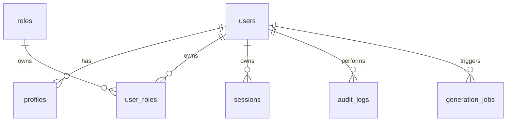

# Data Model v0.2 — go‑vibe‑friend

> 在 v0.1 基础上补充 **生成 Job / 系统设置 / 插件管理** 等模型，以支持 Admin UI 新增功能。
> 兼容 **SQLite / PostgreSQL / MySQL**，采用单租户设计，可通过 `tenant_id` 升级。

---

## 1 · 实体概览

| 实体                   | 说明         | 关键字段                              |
| -------------------- | ---------- | --------------------------------- |
| **users**            | 账号主表       | `email`, `status`                 |
| **profiles**         | 公开信息       | `display_name`                    |
| **roles**            | 角色         | `name`                            |
| **user\_roles**      | 多对多        |  `user_id`, `role_id`             |
| **sessions**         | 刷新 Token   | `refresh_token`                   |
| **audit\_logs**      | 审计轨迹       | `actor_id`, `resource`, `action`  |
| **generation\_jobs** | *新增* 生成作业  | `status`, `progress`, `diff_json` |
| **settings**         | *新增* KV 配置 | `key`, `value`                    |
| **plugins**          | *新增* 插件信息  | `name`, `version`, `enabled`      |
| **system\_logs**     | *新增* 运行日志  | `level`, `message`                |

---

## 2 · ER Diagram (扩展)



---

## 3 · DDL 片段（SQLite / PostgreSQL）

### 3.1 generation\_jobs

```sql
CREATE TABLE IF NOT EXISTS generation_jobs (
  id           INTEGER PRIMARY KEY,
  user_id      INTEGER NOT NULL REFERENCES users(id) ON DELETE CASCADE,
  upload_path  TEXT    NOT NULL,           -- ZIP 路径
  chat_path    TEXT    NOT NULL,           -- 日志路径
  status       TEXT    NOT NULL CHECK (status IN ('queued','running','completed','failed','cancelled')),
  progress     INTEGER NOT NULL DEFAULT 0, -- 0‑100
  diff_json    JSON,                       -- 生成的 patch 摘要
  error_msg    TEXT,
  created_at   TIMESTAMP NOT NULL DEFAULT CURRENT_TIMESTAMP,
  updated_at   TIMESTAMP NOT NULL DEFAULT CURRENT_TIMESTAMP
);
CREATE INDEX IF NOT EXISTS idx_jobs_user ON generation_jobs(user_id);
```

### 3.2 settings (KV)

```sql
CREATE TABLE IF NOT EXISTS settings (
  id          INTEGER PRIMARY KEY,
  key         TEXT NOT NULL UNIQUE,
  value       TEXT NOT NULL,
  description TEXT,
  updated_at  TIMESTAMP NOT NULL DEFAULT CURRENT_TIMESTAMP
);
```

### 3.3 plugins

```sql
CREATE TABLE IF NOT EXISTS plugins (
  id           INTEGER PRIMARY KEY,
  name         TEXT NOT NULL,
  slug         TEXT NOT NULL UNIQUE,      -- 如 retool_adapter
  version      TEXT NOT NULL,
  enabled      BOOLEAN NOT NULL DEFAULT 0,
  config_json  JSON,
  installed_at TIMESTAMP NOT NULL DEFAULT CURRENT_TIMESTAMP
);
```

### 3.4 system\_logs

```sql
CREATE TABLE IF NOT EXISTS system_logs (
  id         INTEGER PRIMARY KEY,
  level      TEXT NOT NULL CHECK (level IN ('DEBUG','INFO','WARN','ERROR')),
  message    TEXT NOT NULL,
  context    JSON,
  created_at TIMESTAMP NOT NULL DEFAULT CURRENT_TIMESTAMP
);
CREATE INDEX IF NOT EXISTS idx_syslog_level ON system_logs(level);
```

---

## 4 · GORM 模型（片段）

```go
// GenerationJob — Bolt/v0 生成任务
 type GenerationJob struct {
     gorm.Model
     UserID     uint
     UploadPath string
     ChatPath   string
     Status     string // queued / running / completed / failed / cancelled
     Progress   uint8  // 0‑100
     DiffJSON   datatypes.JSON
     ErrorMsg   string
 }

// Setting — 全局配置 KV
 type Setting struct {
     ID          uint           `gorm:"primaryKey"`
     Key         string         `gorm:"uniqueIndex;size:64"`
     Value       string         `gorm:"type:text"`
     Description string
     UpdatedAt   time.Time
 }

// Plugin — 外部适配器
 type Plugin struct {
     gorm.Model
     Name       string
     Slug       string `gorm:"uniqueIndex"`
     Version    string
     Enabled    bool
     ConfigJSON datatypes.JSON
 }
```

---

## 5 · 迁移策略更新

1. **生成 Job & KV 表** 需在 `20250718_add_jobs_settings.sql` 中执行。
2. App 启动时仍使用 `AutoMigrate`, 但生产建议 `golang‑migrate` 控制版本。

---

## 6 · 演进路径

| 版本   | 计划新增                                |
| ---- | ----------------------------------- |
| v0.3 | **Redis缓存层** / **异步任务队列** / **会话优化**   |
| v0.4 | `organizations`, `memberships`（多租户）     |
| v0.5 | `api_keys`, `rate_limits`（开发者接入）        |

### v0.3 Redis集成重点

1. **性能提升**：Session读取速度提升90%+
2. **用户体验**：Admin面板响应提升3-5倍
3. **系统稳定性**：LLM任务异步化，避免超时
4. **可扩展性**：为多实例部署做准备

### Redis缓存策略

| 数据类型          | 缓存TTL | 失效策略           | 降级方案     |
| ------------- | ----- | -------------- | -------- |
| **sessions**  | 24h   | 用户登出时清除        | 数据库Session |
| **users**     | 1h    | 用户信息更新时失效      | 实时查询数据库  |
| **permissions** | 30m   | 权限变更时按标签失效     | 实时查询数据库  |
| **settings**  | 5m    | 设置更新时立即失效      | 数据库查询    |

---

> 如有模型设计优化建议，欢迎 Issue / PR！
> Redis集成详细说明请参考 [redis-integration.md](./redis-integration.md)
